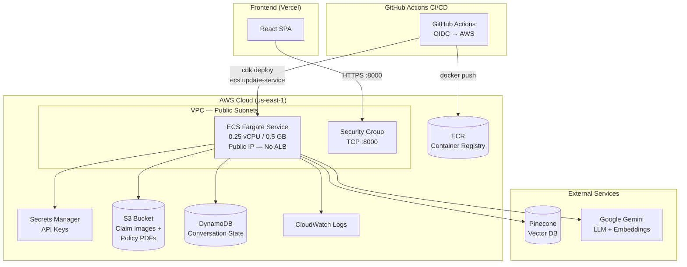
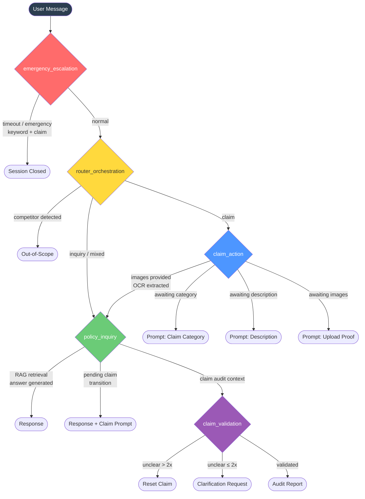

# Travel Insurance Multi-Agent RAG Chat — Backend

[](https://opensource.org/licenses/MIT)
[](https://www.python.org/)
[](https://aws.amazon.com/ecs/)
[](https://aws.amazon.com/cdk/)

Enterprise-grade **multi-agent RAG system** for travel insurance — handles policy inquiries and automates claim filing using LangGraph agent orchestration, Pinecone vector search, and Google Gemini LLM. Deployed on **AWS ECS Fargate** with full Infrastructure as Code (CDK).

**Frontend Repo (Vercel):** https://github.com/vincent168e/travel-insurance-rag-chat-frontend

---

## Architecture

### AWS Infrastructure



### Agent Orchestration Workflow



**5 specialized agents** in a LangGraph state machine:

| Agent                  | Role                                                                 |
| ---------------------- | -------------------------------------------------------------------- |
| `emergency_escalation` | Keyword detection + 30-min session timeout → live-agent handoff      |
| `router_orchestration` | Intent classification (inquiry/claim/mixed), competitor guardrail    |
| `policy_inquiry`       | RAG retrieval from Pinecone → Gemini answer generation               |
| `claim_action`         | Multi-turn form filling: category → description → image upload → OCR |
| `claim_validation`     | Audit against policy clauses, clarification loop (max 2 retries)     |

---

## Tech Stack

| Layer                   | Technology                                     |
| ----------------------- | ---------------------------------------------- |
| **API**                 | FastAPI + Uvicorn                              |
| **Agent Orchestration** | LangGraph (StateGraph + conditional edges)     |
| **LLM**                 | Google Gemini (`gemini-3.1-flash-lite`)        |
| **Embeddings**          | Google Gemini (`gemini-embedding-001`, 1536-d) |
| **Vector DB**           | Pinecone (serverless, `us-east-1`)             |
| **Image Storage**       | AWS S3 (pre-signed URLs)                       |
| **Session State**       | AWS DynamoDB (LangGraph checkpointer)          |
| **Secrets**             | AWS Secrets Manager                            |
| **Container**           | Docker → ECR → ECS Fargate                     |
| **IaC**                 | AWS CDK (Python)                               |
| **CI/CD**               | GitHub Actions (OIDC)                          |
| **Logging**             | CloudWatch Logs                                |
| **Frontend**            | React (deployed on Vercel)                     |

---

## Repository Structure

```
.
├── .github/workflows/
│   └── deploy.yml                    # CI/CD: OIDC → build → CDK → ECS
├── infra/                            # AWS CDK (Infrastructure as Code)
│   ├── app.py                        # CDK entry point
│   ├── cdk.json
│   ├── requirements.txt
│   ├── travel_insurance_stack.py     # ECR, ECS, S3, DynamoDB, VPC, IAM
│   └── github-actions-policy.json    # Least-privilege IAM policy
├── scripts/
│   ├── deploy.sh                     # One-command AWS deployment
│   └── ingest.py                     # S3 → PDF → Chunk → Embed → Pinecone
├── src/
│   ├── agents/                       # Multi-agent node definitions
│   │   ├── claim_action.py
│   │   ├── claim_validation.py
│   │   ├── emergency_escalation.py
│   │   ├── policy_inquiry.py
│   │   └── router_orchestrator.py
│   ├── api/
│   │   └── index.py                  # FastAPI app (chat, upload, health)
│   ├── config.py                     # Env-driven settings
│   ├── database/
│   │   ├── dynamodb_checkpointer.py  # DynamoDB checkpointer factory
│   │   └── pinecone_client.py        # Vector query + embedding
│   ├── graph/
│   │   ├── state.py                  # AgentState TypedDict
│   │   ├── edges.py                  # Conditional routing logic
│   │   └── workflow.py               # LangGraph state machine
│   ├── services/
│   │   └── img_storage.py            # S3 upload + pre-signed URLs
│   ├── schemas.py                    # Pydantic request/response models
│   ├── messages.py                   # User-facing message templates
│   ├── constants.py                  # Emergency keywords, competitors
│   └── utils/
│       └── helpers.py                # Logging, JSON parsing, text utils
├── Dockerfile
├── pyproject.toml
└── .env.example
```

---

## Local Development

### Prerequisites

- Python 3.13+
- [uv](https://docs.astral.sh/uv/) package manager
- Pinecone API key + index
- Google Gemini API key

### Setup

```bash
# Clone and enter project
git clone <repo-url> && cd aws-travel-insurance-rag-chat-backend

# Create virtual environment
uv venv && source .venv/bin/activate

# Install dependencies
uv pip install -r requirements.txt

# Configure environment
cp .env.example .env
# Edit .env with your GEMINI_API_KEY, PINECONE_API_KEY, PINECONE_INDEX_NAME
```

### Run Locally

```bash
# Start the API server
uvicorn src.api.index:app --reload --port 8000

# Health check
curl http://localhost:8000/api/health
```

Local development uses **in-memory `MemorySaver`** (no DynamoDB needed) and skips S3 when `S3_CLAIM_BUCKET` is unset.

---

## AWS Deployment

### Prerequisites

- AWS CLI installed and configured (`aws configure`)
- Docker installed and running
- AWS CDK available (`npm install -g aws-cdk` or auto-installed via `npx`)

### One-Command Deploy

```bash
./scripts/deploy.sh
```

This runs all 7 steps:

| Step | Action                                                   |
| ---- | -------------------------------------------------------- |
| 1    | Install CDK dependencies + bootstrap                     |
| 2    | Deploy infrastructure (ECR, ECS, S3, DynamoDB, VPC, IAM) |
| 3    | Guide to populate Secrets Manager                        |
| 4    | Build & push Docker image to ECR                         |
| 5    | Force ECS service redeployment                           |
| 6    | Wait for service to stabilize                            |
| 7    | Health check + print public IP                           |

**Options:**

```bash
./scripts/deploy.sh --env staging     # Deploy staging stack
./scripts/deploy.sh --with-alb        # Enable Application Load Balancer
./scripts/deploy.sh --skip-secrets    # Skip Secrets Manager prompt
./scripts/deploy.sh --tag v1.2.0      # Custom image tag
```

### Post-Deploy

```bash
# Upload policy PDFs to S3
aws s3 cp path/to/policy.pdf s3://dev-travel-insurance-claims-<account-id>/policies/

# Run ingestion to populate Pinecone
python scripts/ingest.py \
  --bucket dev-travel-insurance-claims-<account-id> \
  --prefix policies/ \
  --policy-tier "Single-trip solutions Canada package"
```

---

## API Endpoints

| Method | Path          | Description                                                          |
| ------ | ------------- | -------------------------------------------------------------------- |
| `POST` | `/api/chat`   | Main chat endpoint — accepts `ChatRequest`, returns `ChatResponse`   |
| `POST` | `/api/upload` | Upload claim evidence images → stored in S3, returns pre-signed URLs |
| `GET`  | `/api/health` | Health check for ECS load balancer / monitoring                      |

### Chat Request

```json
{
  "thread_id": "session-uuid",
  "message": "I need to file a baggage claim",
  "service_category": "claim",
  "claim_category": "baggage",
  "claim_description": "My luggage was lost on flight AC123",
  "claim_stage": "awaiting_description",
  "image_urls": ["https://pre-signed-s3-url..."]
}
```

### Chat Response

```json
{
  "thread_id": "session-uuid",
  "response": "Could you please provide a brief description of what happened?",
  "service_category": "claim",
  "claim_category": "baggage",
  "claim_description": "My luggage was lost on flight AC123",
  "session_closed": false,
  "claim_stage": "awaiting_images",
  "audit_report": null
}
```

---

## CI/CD (GitHub Actions)

Every push to `main` triggers auto-deploy via OIDC (no AWS credentials stored):

1. Checkout → OIDC auth → Docker build → push to ECR
2. CDK deploy (infrastructure as code)
3. ECS service force-redeploy → wait for stable → health check

**To enable:** add `AWS_ROLE_ARN` to GitHub repo secrets and follow the OIDC setup in `infra/github-actions-policy.json`.
